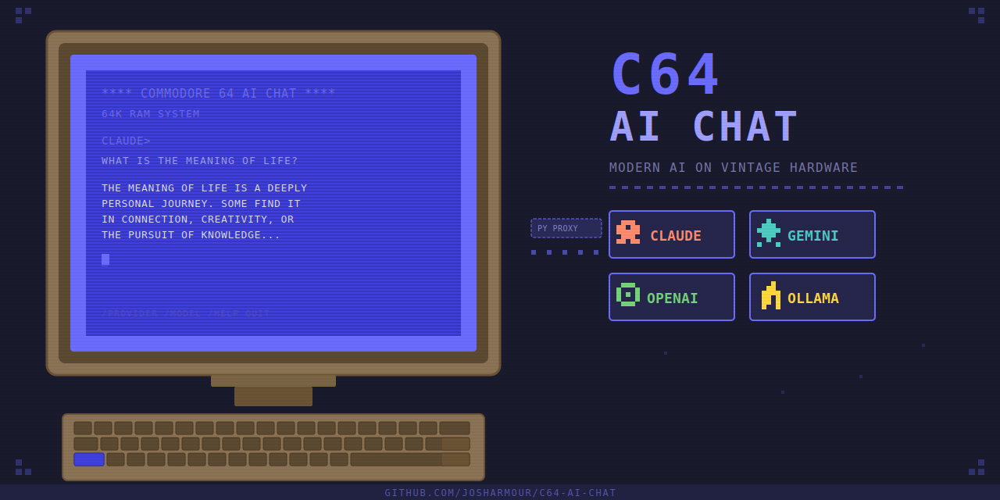

# C64 AI Chat



Talk to modern AI models from a real Commodore 64 over your local network.

A Python proxy server with a tkinter GUI runs on your PC and bridges the gap
between the C64's simple terminal connection and the HTTPS/JSON APIs of modern
AI providers. The C64 runs a small BASIC program that connects to the proxy
over Ethernet (SwiftLink/ACIA) or a WiFi modem.

## Supported AI Backends

| Provider | Requirements |
|----------|-------------|
| **Ollama** | Local install of [Ollama](https://ollama.com) — free, no API key |
| **Google Gemini** | Free API key from [Google AI Studio](https://aistudio.google.com/apikey) |
| **Anthropic Claude** | API key from [Anthropic Console](https://console.anthropic.com) |
| **OpenAI** | API key from [OpenAI Platform](https://platform.openai.com/api-keys) |

## What's in the Box

| File | Purpose |
|------|---------|
| `c64_ai_proxy.py` | Proxy server + GUI (runs on your PC) |
| `aichat.prg` | C64 program — transfer this to your Commodore 64 |
| `aichat.bas` | BASIC source code (if you want to modify and recompile) |
| `bas2prg.py` | BASIC-to-PRG compiler (if you edit aichat.bas) |
| `run_ai_proxy.bat` | Windows double-click launcher for the proxy |

## Requirements

**On your PC:**
- Python 3.8+ with tkinter (included with standard Python installs on Windows/Mac)
- No pip installs needed — pure standard library

**On your C64 / Ultimate 64:**
- A network connection to the same LAN as your PC
- Either:
  - **Ultimate 64 / Ultimate II+ cartridge** with SwiftLink/ACIA modem emulation enabled, OR
  - **WiFi modem** (WiModem, Strikelink, etc.) on the userport

## Quick Start

### 1. Start the proxy on your PC

**Windows:** Double-click `run_ai_proxy.bat`

**Mac/Linux:** Run `python3 c64_ai_proxy.py`

A GUI window will appear.

### 2. Configure a backend

1. Select a provider (Ollama is easiest to start with — no API key needed)
2. Paste your API key if required (Ollama doesn't need one)
3. Click **Probe Models** — available models will appear
4. Select a model from the list

Your API keys and last selection are saved automatically.

### 3. Start the server

Click **Start Server**. The status should show **RUNNING** on port 6464.

### 4. Transfer aichat.prg to your C64

Copy `aichat.prg` to your C64's SD card via FTP, USB, or however you
normally transfer files. Then on the C64:

```
LOAD "AICHAT",8,1
RUN
```

### 5. Connect

The program will ask for the server address. Enter your PC's local IP
and port, for example:

```
SERVER:PORT? 192.168.1.100:6464
```

Press RETURN and you should see a `CONNECT` response followed by a welcome
banner and prompt. Start chatting!

## Ultimate 64 / Ultimate II+ Setup

If you're using the Ultimate 64's built-in ethernet (not a physical WiFi modem),
you need to enable the modem emulation:

1. Press **F2** to open the Ultimate menu
2. Navigate to the modem/ACIA settings
3. Set **Modem Interface** to **ACIA / SwiftLink**
4. Set **ACIA (base) Mapping** to **DE00/IRQ**
5. Set **Hardware Mode** to **SwiftLink**
6. Make sure the FTP server is enabled (for easy file transfers)
7. Save and reboot

## WiFi Modem Setup

If you're using a physical WiFi modem (WiModem, etc.) on the userport,
you may need to edit `aichat.bas` to use the RS-232 device instead of
the SwiftLink ACIA. The original RS-232 version uses:

```basic
OPEN 2,2,0,CHR$(6)
PRINT#2, "ATDT <ip>:<port>"
```

See the BASIC source for details, then recompile with:
```
python3 bas2prg.py aichat.bas aichat.prg
```

## C64 Commands

Once connected, type these at the prompt:

| Command | Action |
|---------|--------|
| `/provider` | Switch AI backend (Claude/Gemini/OpenAI/Ollama) |
| `/model` | Browse and switch models for the current provider |
| `/help` | Show available commands |
| `clear` | Clear chat history and screen |
| `quit` | Disconnect |

You can also switch providers and models from the PC-side GUI at any time —
the C64 prompt updates on the next interaction.

## Scrollback

Press **SHIFT + cursor down** (cursor up) at the prompt to enter scrollback
mode. Use cursor up/down to page through previous output. Press any other
key to return to the prompt.

## Tips

- **Ollama** is the best starting point — it's free, runs locally, and has
  no API key. Install it from https://ollama.com then pull a model:
  `ollama pull llama3.2`
- The proxy converts all text to **uppercase** for the C64's default
  character set
- Text is **word-wrapped at 40 columns** to fit the C64 screen
- The **delete key** works for correcting typos
- All conversations are logged to `c64_ai_chat.log` on the PC
- API keys are saved in `c64_ai_proxy_config.json` so you only enter
  them once

## Modifying the BASIC Program

Edit `aichat.bas` with any text editor, then recompile:

```
python3 bas2prg.py aichat.bas aichat.prg
```

Transfer the new `aichat.prg` to your C64.

## Troubleshooting

**"Keyboard doesn't do anything on the C64"**
- Make sure the proxy is running and shows RUNNING status
- Verify the IP address and port are correct
- Check that SwiftLink/ACIA emulation is enabled on the Ultimate 64

**"API ERROR ENCOUNTERED"**
- Some models don't work with all API configurations
- Use `/model` to try a different model
- Check the proxy GUI log for detailed error info

**"No models found" when probing**
- Verify your API key is correct
- For Ollama, make sure it's running (`ollama serve`)
- Check your internet connection for cloud providers

## License

This project is open source. Use it, share it, modify it.
# c64-ai-chat
Chat with AI from a real Commodore 64 — supports Claude, Gemini, OpenAI, and Ollama
